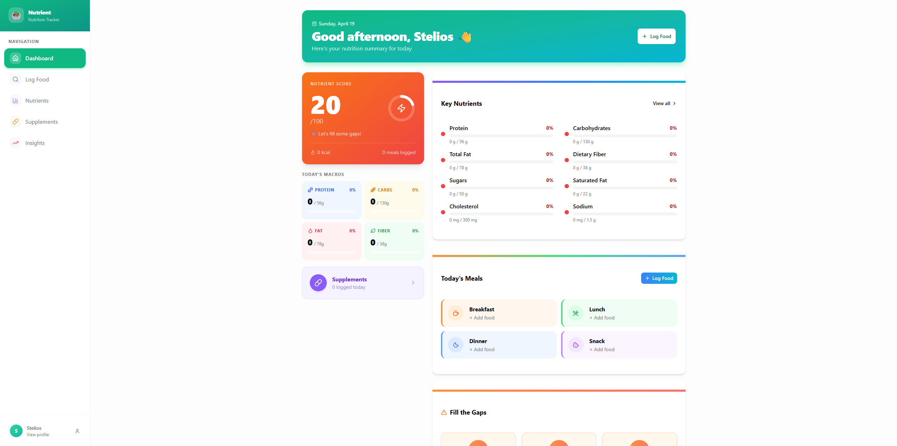

<div align="center">


# 🥦 NUTRIENT.IO
### *The Ultimate Micronutrient Tracking Platform*

> Know exactly what your body is getting — and what it's missing.

[](LICENSE)
[](https://www.postgresql.org/)
[](https://react.dev/)
[](https://nodejs.org/)
[](https://github.com/Stelios-developer/Nutrient-io/commits)
[](https://github.com/Stelios-developer/Nutrient-io)

<br/>



</div>

---

## 📖 About

**NUTRIENT.IO** is a full-stack micronutrient tracking application that goes far beyond calorie counting. Built for people who care about the quality — not just the quantity — of what they eat, it delivers science-backed, personalized nutrient targets based on your age, sex, life stage, and health goals.

Whether you're an athlete optimizing iron intake, a vegan monitoring B12, or just someone who wants to know if they're getting enough Vitamin D — NUTRIENT.IO gives you the data, the insights, and the clarity to take control of your nutrition.

---

## ✨ Features

### 🧬 Science-Backed Personalization
Nutrient targets are calculated using **DRI (Dietary Reference Intakes)** from the National Academies — the gold standard in nutrition science. Targets adjust automatically for your age, sex, pregnancy, lactation, and activity level.

### 📊 Micronutrient Dashboard
A real-time overview of **30+ tracked nutrients** — vitamins, minerals, macros, amino acids, and more. Every nutrient is color-coded by status:

| Status | Range | Indicator |
|---|---|---|
| 🟢 Optimal | 90–110% RDA | ✓ |
| 🟡 Adequate | 75–89% RDA | ↗ |
| 🟠 Suboptimal | 50–74% RDA | → |
| 🔴 Low | 25–49% RDA | ↓ |
| ⚠️ Critical | < 25% RDA | ⚠️ |
| 🟣 Near Limit | > 80% UL | ⚡ |
| 🚫 Excess | > UL | 🚫 |

### 🍽️ Smart Food Logging
Search from a database powered by **USDA FoodData Central**, with support for branded foods, recipes, and supplements. Confidence scoring flags estimated or low-quality nutrient data so you always know how reliable your log is.

### 📈 Trends & Analytics
Visualize your intake over time with interactive charts (weekly, monthly, 90-day). Spot deficiencies before they become problems, and track how your diet evolves with your goals.

### 🔔 Intelligent Alerts
The built-in Insight Engine proactively flags:
- Sustained deficiencies (3+ days below 50% RDA)
- Nutrient interactions (e.g., Vitamin C boosting iron absorption)
- Toxicity risks when approaching UL thresholds
- Correlation patterns between how you eat and how you feel

### 🧪 Supplement vs Food Tracking
Log food and supplements separately. NUTRIENT.IO accounts for **bioavailability differences** (e.g., heme vs. non-heme iron, citrate vs. carbonate calcium) so your numbers are actually meaningful.

### 🎯 Goal-Based Targets
Set custom nutrition goals — muscle gain, immune support, energy, bone health — and let the app recalibrate your targets accordingly. Override any target manually with a single tap, with safety warnings if you exceed UL.

### 🔒 Secure & Private
All sensitive configuration is handled through environment variables. Passwords are hashed, UUIDs are used throughout, and the schema is designed with security-first principles.

---

## 🛠️ Tech Stack

| Layer | Technology | Purpose |
|---|---|---|
| **Frontend** | React.js | Component-based UI |
| **Styling** | Tailwind CSS | Utility-first responsive design |
| **Charts** | Recharts | Nutrient trend visualizations |
| **Backend** | Node.js + Express.js | REST API server |
| **Database** | PostgreSQL 15+ | Relational data with UUID support |
| **Extensions** | `uuid-ossp`, `pg_trgm` | UUID generation & fuzzy food search |
| **Auth** | JWT + bcrypt | Secure authentication |
| **Environment** | dotenv | Secure credential management |
| **Version Control** | Git & GitHub | Source control |

---

## 📋 Prerequisites

Make sure you have the following installed before getting started:

- [Node.js](https://nodejs.org/) v18+
- [npm](https://www.npmjs.com/) v9+
- [PostgreSQL](https://www.postgresql.org/) v15+
- A PostgreSQL client (e.g. [TablePlus](https://tableplus.com/), [DBeaver](https://dbeaver.io/), or `psql`)

---

## 🚀 Getting Started

### 1. Clone the Repository

```bash
git clone https://github.com/Stelios-developer/Nutrient-io.git
cd Nutrient-io
```

### 2. Set Up the Database

Open your PostgreSQL client and run the schema file:

```bash
psql -U your_postgres_user -d postgres -c "CREATE DATABASE nutrientio;"
psql -U your_postgres_user -d nutrientio -f database/schema.sql
```

### 3. Configure the Backend

```bash
cd backend
cp .env.example .env
```

Open `.env` and fill in your values:

```env
# Server
PORT=5000
NODE_ENV=development

# Database
DB_HOST=localhost
DB_PORT=5432
DB_NAME=nutrientio
DB_USER=your_postgres_user
DB_PASSWORD=your_postgres_password

# Auth
JWT_SECRET=your_super_secret_jwt_key_here
JWT_EXPIRES_IN=7d

# Optional: USDA FoodData Central API
USDA_API_KEY=your_usda_api_key
```

Then install dependencies and start the server:

```bash
npm install
npm run dev
```

The API will be available at `http://localhost:5000`

### 4. Configure the Frontend

```bash
cd ../frontend
cp .env.example .env
```

```env
REACT_APP_API_URL=http://localhost:5000/api
```

```bash
npm install
npm start
```

The app will open at `http://localhost:3000` 🎉

---

## 📁 Project Structure

```
nutrient-io/
│
├── frontend/                   # React application
│   ├── public/
│   │   └── index.html
│   ├── src/
│   │   ├── components/         # Reusable UI components
│   │   │   ├── Dashboard/
│   │   │   ├── FoodLog/
│   │   │   ├── NutrientCard/
│   │   │   ├── Charts/
│   │   │   └── Alerts/
│   │   ├── pages/              # Route-level views
│   │   │   ├── Home.jsx
│   │   │   ├── Dashboard.jsx
│   │   │   ├── FoodLog.jsx
│   │   │   ├── Trends.jsx
│   │   │   └── Profile.jsx
│   │   ├── hooks/              # Custom React hooks
│   │   ├── context/            # Global state (Auth, Theme)
│   │   ├── utils/              # Calculation helpers & formatters
│   │   └── App.jsx
│   ├── .env.example
│   └── package.json
│
├── backend/                    # Node.js + Express API
│   ├── src/
│   │   ├── routes/             # API route definitions
│   │   │   ├── auth.js
│   │   │   ├── foods.js
│   │   │   ├── logs.js
│   │   │   ├── nutrients.js
│   │   │   └── users.js
│   │   ├── controllers/        # Route handler logic
│   │   ├── middleware/         # Auth, error handling
│   │   ├── models/             # Database query layers
│   │   └── server.js
│   ├── .env.example
│   └── package.json
│
├── database/
│   └── schema.sql              # Full PostgreSQL schema
│
├── screenshots/                # App preview images
│   └── dashboard.png
│
├── .gitignore
├── LICENSE
└── README.md
```

---

## 🔌 API Overview

| Method | Endpoint | Description |
|---|---|---|
| `POST` | `/api/auth/register` | Create a new account |
| `POST` | `/api/auth/login` | Login and receive JWT |
| `GET` | `/api/users/me` | Get current user profile |
| `PUT` | `/api/users/me` | Update profile & health data |
| `GET` | `/api/foods/search?q=banana` | Search food database |
| `GET` | `/api/foods/:id` | Get food nutrient breakdown |
| `GET` | `/api/logs?date=2024-04-19` | Get food log for a date |
| `POST` | `/api/logs` | Add food entry to log |
| `DELETE` | `/api/logs/:id` | Remove log entry |
| `GET` | `/api/nutrients/targets` | Get personalized RDA targets |
| `GET` | `/api/nutrients/summary?range=7d` | Get nutrient trend data |
| `GET` | `/api/alerts` | Get active insight alerts |

---

## 🧠 How Targets Are Calculated

NUTRIENT.IO doesn't use a one-size-fits-all RDA. Every target is computed dynamically:

```javascript
function calculateTarget(nutrient, user) {
  const base = getRDABase(nutrient, user.sex, user.age);

  if (user.isPregnant)   return base + getPregnancyIncrement(nutrient);
  if (user.isLactating)  return base + getLactationIncrement(nutrient);
  if (user.activityLevel === 'athlete' && nutrient === 'iron')
                          return base * 1.30; // +30% for endurance athletes

  return base;
}
```

Supported life stages: **Infants · Children · Adolescents · Adults · Pregnancy (all trimesters) · Lactation**

Regional standards supported: 🇺🇸 DRI · 🇪🇺 EFSA · 🇬🇧 DRVs · 🇦🇺 NRVs

---

## 🤝 Contributing

Contributions are always welcome! Here's how to get involved:

1. **Fork** this repository
2. **Create** a new branch: `git checkout -b feature/your-feature-name`
3. **Commit** your changes: `git commit -m "Add: your feature description"`
4. **Push** to your branch: `git push origin feature/your-feature-name`
5. **Open** a Pull Request and describe what you changed

Please read [CONTRIBUTING.md](CONTRIBUTING.md) for code standards and guidelines.

---

## 📜 License

This project is licensed under the **MIT License** — see the [LICENSE](LICENSE) file for details.

---

<div align="center">

Built with 💚 by [Stelios](https://github.com/Stelios-developer)

*If you find this project useful, consider giving it a ⭐ — it helps a lot!*

</div>
